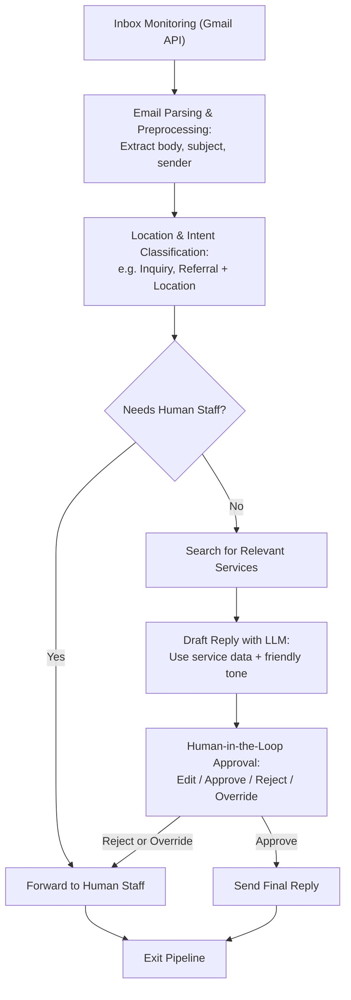

```mermaid
graph TD;
    A["Inbox Monitoring (Gmail API)"] --> B["Email Parsing & Preprocessing:<br>Extract body, subject, sender"]
    B --> C["Location & Intent Classification:<br>e.g. Inquiry, Referral + Location"]
    C --> D{"Needs Human Staff?"}
    
    D -- Yes --> E["Forward to Human Staff"]
    E --> Z["Exit Pipeline"]

    D -- No --> F["Search for Relevant Services"]
    F --> G["Draft Reply with LLM:<br>Use service data + friendly tone"]
    G --> H["Human-in-the-Loop Approval:<br>Edit / Approve / Reject / Override"]

    H -->|Approve| I["Send Final Reply"]
    H -->|Reject or Override| E
    I --> Z
```